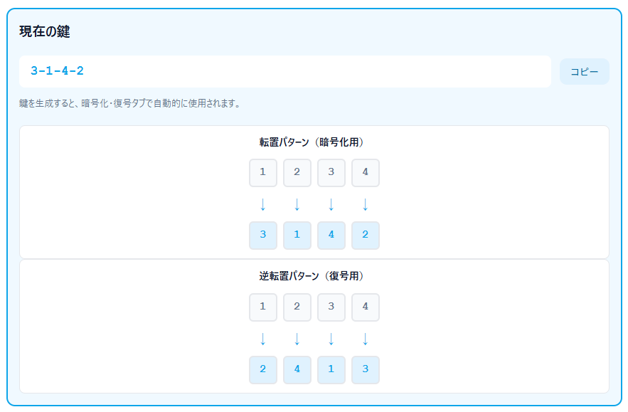

<!--
---
title: Permutation CipherLab
category: classical-cryptography
difficulty: 1
description: Interactive tool for exploring permutation ciphers — define, edit, and visualize custom transposition patterns.
tags: [cipher, permutation, transposition, education, javascript]
demo: https://ipusiron.github.io/permutation-cipherlab/
---
-->

# Permutation CipherLab - 転置式暗号ツール


[](https://ipusiron.github.io/permutation-cipherlab/)

**Day095 - 生成AIで作るセキュリティツール100**

**Permutation CipherLab** は、文字列を任意の並び順（例：`3-1-4-2`）で転置することで暗号化・復号化を体験できるWebツールです。

ユーザーはGUI上で転置パターンを自由に定義・編集・保存し、平文の並び替えルールを視覚的に理解できます。

---

## 🌐 デモページ

👉 **[https://ipusiron.github.io/permutation-cipherlab/](https://ipusiron.github.io/permutation-cipherlab/)**

ブラウザーで直接お試しいただけます。

---

## 📸 スクリーンショット

>
>*鍵として生成した転置パターンとその逆転値パターン*

---

## 👥 対象ユーザー

- **暗号理論の初学者**: 古典暗号の基本概念を実際に操作しながら学びたい方
- **情報セキュリティ専攻の学生**: 転置暗号の仕組みを視覚的に理解し、演習に活用したい方
- **プログラミング教育者**: 順列・配列操作の教材として使いたい方
- **暗号技術の愛好家**: 古典暗号から現代暗号への発展過程を体験的に学びたい方
- **CTF・パズル愛好者**: 転置暗号を使った問題作成や解析を試したい方
- **数学教育者**: 順列の概念や逆写像を具体例で説明したい方

---

## ⚙️ 主な機能

### 🔑 鍵生成タブ
| 機能 | 説明 |
|------|------|
| 🎲 ランダム生成 | 指定したパターン長でランダムな転置パターンを生成（Fisher-Yates法） |
| ✏️ 手動入力 | 例：`3-1-4-2` のように直接入力して検証・適用 |
| 🎨 ビジュアル編集 | ドラッグ＆ドロップで直感的にパターンを作成 |
| 📊 パターン可視化 | 転置パターンと逆転置パターンを矢印付きで視覚的に表示 |
| 💾 保存／読込 | `localStorage` に複数のパターンを保存し、名前付きで管理 |
| 📋 プリセット長 | 2/4/8/12/16/20の一般的なブロック長をワンクリック選択 |

### 🔐 暗号化タブ
| 機能 | 説明 |
|------|------|
| 📝 例文プリセット | 5つの例文から選択して即座に入力可能 |
| 🔄 ブロック暗号化 | パターン長ごとにブロック分割して転置を適用 |
| 🔲 パディング設定 | 不足ブロックを指定文字（デフォルト: X）で補完（ON/OFF切替） |
| 🔍 ブロック別対応表 | 各ブロックの平文→暗号文の対応を表で表示 |
| ⬅️➡️ ブロックナビゲーション | 複数ブロックを矢印ボタンで切り替えて確認 |
| 🎞️ アニメーション | 最初のブロックが1文字ずつ転置される様子を視覚化 |
| 📤 復号タブへ送信 | 暗号化結果をワンクリックで復号タブに転送 |

### 🔓 復号タブ
| 機能 | 説明 |
|------|------|
| ⏪ 逆転置復号 | 自動計算された逆転置パターンで復号を実行 |
| ✂️ パディング除去 | 末尾のパディング文字を自動トリム（ON/OFF切替） |
| 🔍 対応表表示 | 暗号文→平文の対応関係を表で表示 |

### 📚 座学タブ
| 機能 | 説明 |
|------|------|
| 🏛️ 歴史的背景 | スキュタレーからAESまでの転置暗号の歴史をタイムライン形式で紹介 |
| 🔑 基本原理 | 順列による転置の仕組みを具体例と表で解説 |
| 🔐 置換暗号との比較 | 転置と置換の違いを比較表で明示 |
| ⚡ 強度と弱点 | アルゴリズムの特性を強み/弱点に分けて整理 |
| 🎓 教育的価値 | 順列・逆写像・拡散などの暗号学習ポイントを列挙 |
| 🔗 関連暗号技術 | レールフェンス、カラムナー、ADFGVX、DESとの関連を説明 |

---

## 🧠 転置式暗号とは

転置式暗号（Permutation Cipher）は、**文字の並び順だけを入れ替える暗号**であり、置換暗号とは異なり文字自体は変化しません。

この単純な仕組みが、後の高度な暗号理論の基礎を形づくりました。

### 📜 起源と歴史

- 古代スパルタの **スキュタレー暗号（Scytale Cipher）** が最古の転置暗号の1つ。  
  棒に巻きつけた羊皮紙の並びでメッセージを再構成しました。  
- 中世以降は、**縦列転置式暗号（Columnar Cipher）** や **レールフェンス暗号** などの形で応用。  
- 現代暗号では、**ブロック暗号のP-Box（Permutation Box）** に発展し、拡散（diffusion）の役割を担っています。

### 🔍 例：Permutation = "3-1-4-2"

転置パターン `3-1-4-2` は「位置1の文字を位置3へ、位置2の文字を位置1へ、位置3の文字を位置4へ、位置4の文字を位置2へ」という変換を意味します。

| 元の位置 | 1 | 2 | 3 | 4 |
|---------|---|---|---|---|
| 平文 | E | N | I | G |
| ↓ | →3 | →1 | →4 | →2 |
| 暗号文 | N | G | E | I |

結果：**ENIG → NGEI**

逆転置パターンは自動計算され、復号時に使用されます（`3-1-4-2` の逆は `2-4-1-3`）。

### 📦 ブロック処理とパディング

本ツールはブロック暗号方式を採用しており、パターン長がブロックサイズとなります。

#### ブロック分割の仕組み
- **パターン長4の場合**: 入力文字列を4文字ごとに分割し、各ブロックに独立して転置を適用
- **複数ブロック**: ブロックナビゲーション機能で各ブロックの変換結果を個別に確認可能

#### パディング設定（デフォルト: ON）
- **✅ パディング有効時**: 最後のブロックが不足する場合、指定文字（デフォルト: `X`）で補完してから転置
  - 例: `ENIGMA` (6文字、パターン長4)
    - ブロック1: `ENIG` → 転置 → `NGEI`
    - ブロック2: `MA` → パディング → `MAXX` → 転置
    - 結果: すべてのブロックで転置が適用される

- **❌ パディング無効時**: 最後の不足ブロックは**転置せずそのまま**出力
  - 例: `ENIGMA` (6文字、パターン長4)
    - ブロック1: `ENIG` → 転置 → `NGEI`
    - ブロック2: `MA` → そのまま → `MA`
    - 結果: 不足ブロックは変換されない

#### 復号時の注意
- パディング除去機能（デフォルト: ON）を使用すると、末尾のパディング文字を自動的に削除
- ⚠️ **注意**: 元の平文の末尾に同じ文字が含まれていた場合、それも削除される可能性があります

---

## 🔀 他の転置式暗号との比較表

| 暗号方式 | 暗号化方法 | 鍵の形式 | ブロック処理 | 歴史的背景 | セキュリティ強度 | 本プロジェクトでの実装 |
|---------|-----------|---------|------------|-----------|--------------|----------------|
| **順列転置暗号** | 固定長ブロックごとに順列パターンで位置を入れ替え | 数値配列<br>例: `[3,1,4,2]` | 固定長ブロック単位<br>（パディング自動） | 現代的な教育ツール | 鍵空間 = n!<br>（nはブロック長） | ✅ **実装済み**<br>本ツール |
| **スキュタレー暗号**<br>(Scytale) | 紐を巻いた棒に文字を書き、解くと暗号化 | 棒の直径（整数） | 棒の円周分が1行 | 古代ギリシャ・スパルタ（紀元前5世紀）| 非常に低い<br>（鍵空間が小さい） | [Scytale Cipher Visualizer](https://ipusiron.github.io/scytale-cipher-visualizer/) |
| **レールフェンス暗号**<br>(Rail Fence) | ジグザグパターンで文字を配置し、行ごとに読む | レール数（整数） | 全文を一括処理 | 19世紀の電信技術時代 | 非常に低い<br>（鍵空間 < 10） | [RailFence CipherLab](https://ipusiron.github.io/railfence-cipherlab/) |
| **縦列転置暗号**<br>(Columnar) | 鍵の辞書順で列を並び替え | 文字列<br>例: `"ZEBRA"` → `[5,2,1,3,4]` | 列数 = 鍵長で固定 | 第一次世界大戦で軍事利用 | 低〜中<br>（鍵長に依存） | [Columnar CipherLab](https://ipusiron.github.io/columnar-cipherlab/) |
| **経路暗号**<br>(Route Cipher) | 格子状に配置し、特定経路で読み取り | 経路パターン<br>（螺旋、対角線など） | 全文を一括処理 | 中世〜近世 | 低い<br>（経路の種類は限定的） | ❌ 未実装<br>（2次元配置が必要） |
| **二重転置暗号**<br>(Double Transposition) | 2回の列転置を連続適用 | 2つの文字列鍵 | 第1鍵の列数、第2鍵の列数 | 第二次世界大戦で実戦使用 | 中<br>（単一転置より強い） | ⚠️ **本ツールを手動で実現可能**<br>暗号化→復号化を逆順で2回適用 |

---

### 💡 特殊ケース：レールフェンス暗号との等価性

レールフェンス暗号の **順次配置（方式1）** は、特定の条件下で本ツールの順列転置と等価になります。

⚠️ **重要な制約**: レールフェンス暗号は平文全体を一括処理しますが、本ツールはブロック暗号方式です。等価にするには、**ブロック長を平文長と一致させる必要があります**。

#### レールフェンス暗号：順次配置（方式1）

[RailFence CipherLab](https://ipusiron.github.io/railfence-cipherlab/) の順次配置は、文字を各レールに順番に割り振り、レールごとに読み取る方式です（縦列転置暗号と等価）。

**レール数=2 の場合**:

```
入力: ABCDEFGH

順次配置:
レール1: A C E G
レール2: B D F H

読み取り順（レール1→レール2）: ACEG BDFH
暗号文: ACEGBDFH
```

これは本ツールでは **ブロック長=8, パターン=[1,3,5,7,2,4,6,8]** として表現できます。

**レール数=3 の場合**:

```
入力: ABCDEFGHI

順次配置:
レール1: A D G
レール2: B E H
レール3: C F I

読み取り順（レール1→レール2→レール3）: ADG BEH CFI
暗号文: ADGBEHCFI
```

これは本ツールでは **ブロック長=9, パターン=[1,4,7,2,5,8,3,6,9]** として表現できます。

**レール数=4 の場合**:

```
入力: ABCDEFGHIJKL

順次配置:
レール1: A E I
レール2: B F J
レール3: C G K
レール4: D H L

読み取り順: AEI BFJ CGK DHL
暗号文: AEIBFJCGKDHL
```

これは本ツールでは **ブロック長=12, パターン=[1,5,9,2,6,10,3,7,11,4,8,12]** として表現できます。

#### 本ツールで再現可能なパターン

| レール数 | ブロック長 | 本ツールのパターン | 説明 |
|---------|-----------|-------------------|------|
| 2 | 8 | `[1,3,5,7,2,4,6,8]` | 奇数位置→偶数位置 |
| 3 | 9 | `[1,4,7,2,5,8,3,6,9]` | 3列ごとの縦列転置 |
| 4 | 12 | `[1,5,9,2,6,10,3,7,11,4,8,12]` | 4列ごとの縦列転置 |
| n | n×m | 一般式: 列優先で読み取り | **縦列転置暗号と等価** |

#### パターンの一般式

レール数 `r`、1レールあたり `c` 文字の場合、ブロック長 `n = r × c` として:

```
パターン[i] = ((i % r) × c) + (i ÷ r) + 1
```

例: レール数3、1レールあたり3文字 (n=9)
- 位置0 → (0×3)+0+1 = 1
- 位置1 → (1×3)+0+1 = 4
- 位置2 → (2×3)+0+1 = 7
- 位置3 → (0×3)+1+1 = 2
- ...

結果: `[1,4,7,2,5,8,3,6,9]` ✓

**実験方法**:
1. 本ツールの【鍵生成タブ】で `1-3-5-7-2-4-6-8` を手動入力（パターン長=8）
2. 【暗号化タブ】で `ABCDEFGH` を暗号化（**重要**: 入力は8文字でブロック長と一致）
3. 結果 `ACEGBDFH` が得られることを確認
4. [RailFence CipherLab](https://ipusiron.github.io/railfence-cipherlab/) で同じ入力・レール数=2・方式1（順次配置）で比較

⚠️ **注意**: 入力が `ABCDEFGHIJK`（11文字）など、ブロック長（8文字）の倍数でない場合、本ツールは複数ブロックに分割して処理するため、レールフェンス暗号とは結果が異なります。等価性を確認するには、**入力文字数 = ブロック長** とする必要があります。

---

### 💡 縦列転置暗号との等価性

縦列転置暗号（Columnar Transposition Cipher）も、特定の条件下で本ツールの順列転置と等価になります。

⚠️ **重要な制約**: 縦列転置暗号も平文全体を一括処理します。等価にするには、**ブロック長を平文長と一致させる必要があります**。

#### 縦列転置暗号の動作原理

[Columnar CipherLab](https://ipusiron.github.io/columnar-cipherlab/) の縦列転置は以下の手順で動作します：

1. **行方向に配置**: 平文を列数分の幅で行方向に配置
2. **列の並び替え**: 鍵の順序に従って列を並び替え
3. **列方向に読み取り**: 並び替え後の各列を上から下に読み取って連結

#### 本ツールとの対応関係

**例1: 鍵 "3-1-4-2" で 12文字を暗号化**

縦列転置暗号（列数=4）:
```
入力: ABCDEFGHIJKL

行方向に配置（4列×3行）:
1列  2列  3列  4列
A    B    C    D
E    F    G    H
I    J    K    L

鍵 "3-1-4-2" で列を並び替え → 3列→1列→4列→2列の順

読み取り順:
3列(CGK) → 1列(AEI) → 4列(DHL) → 2列(BFJ)

暗号文: CGKAEIDHLBFJ
```

本ツールでの等価パターン（ブロック長=12）:
```
鍵 "3-1-4-2" は以下の変換を意味:
位置1→3, 位置2→1, 位置3→4, 位置4→2
位置5→7, 位置6→5, 位置7→8, 位置8→6
位置9→11, 位置10→9, 位置11→12, 位置12→10

パターン: [3,1,4,2,7,5,8,6,11,9,12,10]
```

**検証**:
```
ABCDEFGHIJKL
↓ パターン [3,1,4,2,7,5,8,6,11,9,12,10] で変換
CADBGEHFKIJL
```

⚠️ **問題点**: 本ツールの順列転置は「位置の入れ替え」であり、縦列転置の「列方向の読み取り」とは**異なる処理**のため、直接的には等価になりません。

#### 正しい対応パターンの計算

縦列転置を本ツールで再現するには、以下の変換が必要です：

**行列の次元**:
- 列数（鍵の長さ）: `c = 4`
- 行数: `r = 3`
- ブロック長: `n = c × r = 12`

**位置マッピング**:
```
元の位置（行優先） → 列方向読み取り後の位置

行方向インデックス → (行, 列) → 鍵順並び替え後の列 → 列方向読み取り位置

A(0) → (0,0) → 鍵[0]=3 → 列3 → 3列目の0行目 → 暗号文位置6
B(1) → (0,1) → 鍵[1]=1 → 列1 → 1列目の0行目 → 暗号文位置0
C(2) → (0,2) → 鍵[2]=4 → 列4 → 4列目の0行目 → 暗号文位置9
D(3) → (0,3) → 鍵[3]=2 → 列2 → 2列目の0行目 → 暗号文位置3
E(4) → (1,0) → 鍵[0]=3 → 列3 → 3列目の1行目 → 暗号文位置7
...

パターン（読み替え後）: [2,5,8,11,1,4,7,10,3,6,9,12] (1-based)
```

実際の暗号文 `CGKAEIDHLBFJ` を分解:
- C(2), G(6), K(10) → 3列目を縦読み
- A(0), E(4), I(8) → 1列目を縦読み
- D(3), H(7), L(11) → 4列目を縦読み
- B(1), F(5), J(9) → 2列目を縦読み

**結論**: 縦列転置は「2次元配置→列方向読み取り」という複雑な処理のため、単純な1次元順列では完全には再現できません。ただし、特定のブロック長では、対応する順列パターンを計算することで等価な結果を得られます。

#### 実験方法

本ツールで縦列転置を近似的に再現するには：

1. **入力文字数を列数の倍数にする**: 例: 鍵長4なら、入力を8文字、12文字、16文字など
2. **対応パターンを手計算で求める**: 上記の位置マッピング式を使用
3. **【鍵生成タブ】で計算したパターンを入力**
4. **【暗号化タブ】で暗号化を実行**
5. [Columnar CipherLab](https://ipusiron.github.io/columnar-cipherlab/) と結果を比較

⚠️ **制約**: 縦列転置は本質的に2次元操作なので、本ツールの1次元順列とは処理モデルが異なります。完全な等価性を得るには、入力長と鍵を慎重に選ぶ必要があります。

---

### 🔍 本ツールの位置づけ

- **柔軟性**: 任意の順列パターンを自由に定義可能（他の転置暗号は固定パターン）
- **可視化**: 転置の動きを矢印やアニメーションで視覚的に理解できる
- **教育性**: 順列の概念、逆写像、鍵空間の大きさ（階乗）を体験的に学べる
- **拡張性**: 手動入力を工夫すれば、列転置暗号や二重転置暗号の動作も部分的に再現可能

---

## 💬 教育的意義

- **単純な並び替えでも「鍵」として機能する**ことを直感的に理解できる  
- 暗号理論の2大要素「置換（Substitution）」と「転置（Permutation）」の違いを体験的に学べる  
- 近代暗号（DESやAESなど）で使われる「置換＋転置」構造の出発点を体験できる  

---

## 🧭 活用シナリオ（具体例）

### 1. CTF（Capture The Flag）初心者向けチャレンジの作成と解法演習 🔐🏁
**概要**  
短い転置暗号を使ったCTF形式の問題を作成し、参加者に復号の手順を学ばせる。問題は難易度調整しやすく、ヒント（ブロック長や部分的な鍵）を段階的に出すことで教育的価値を高められる。

**想定ワークフロー（運営側）**
1. 【鍵生成タブ】パターン長4を選択し、ランダム生成または手動で `3-1-4-2` を設定
2. 【暗号化タブ】平文（例: `FLAG{TRY_PERM}`）を入力し、パディング有効で暗号化を実行
3. 得られた暗号文を問題として掲載し、「ブロック長は4」「パディングは X」といったヒントを段階的に提示
4. 解答には、Permutation CipherLab の【復号タブ】を使うよう指示（参加者の学習効果を高めるため）

**参加者の学び**
- ブロック処理の概念、パディングの重要性、パターン推定（推測・試行）による復号手法を体感できる。  
- 自動化スクリプトを書く前に手作業で仕組みを理解するステップになる。

---

### 2. レッドチーム演習 / ペネトレーションテストのトレーニング素材（教育目的） 🛡️🧰
**概要（注意：教育・訓練目的に限定）**  
転置を含むレガシーな暗号処理が残る古い社内システムの「模擬ログ」や「設定ファイル」を用意し、解析・復号の練習用シナリオを作成する。演習チームは、安全な演習用環境でログ解析や手動復号の手順を学ぶ。

**想定ワークフロー（演習設計）**
1. 旧システムのログ形式を模したダミーデータを用意し、そこに簡易な転置で「ヒント」や「フラグ」を隠す。  
2. 受講者（ブルーチーム／レッドチーム候補）は、Permutation CipherLab を使って手動で復号を試み、復号結果から次の演習フェーズ（例えば認証試行の模擬）に進む。  
3. 演習後、ログ保全・暗号処理の設計欠陥、検出のための監査ポイントをレビューする。

**教育的注意点**
- 実運用システムを攻撃する手順やツールは教えない（禁止）。必ず隔離された演習用環境で行い、倫理・ルールを明示する。  
- 目的は「ログや設定に簡易な暗号が残ると何が起きるか」を理解し、防御策（監査・ログの正規化・暗号管理）の重要性を学ぶことにある。

---

### 3. 教室／ワークショップ教材（暗号の基礎を視覚で学ぶ） 🏫🖥️
**概要**  
授業やワークショップで、学生が順列（permutation）という概念を直感的に理解できるハンズオン教材として使用する。視覚的な対応表とアニメーションを組み合わせて教えると理解が早い。

**授業案（50分）**
1. 10分：【座学タブ】を見せながらスキュタレーやカラムナー暗号の歴史を説明
2. 15分：【鍵生成タブ】で `3-1-4-2` を生成し、可視化機能で転置と逆転置の関係を実演
3. 15分：【暗号化タブ】で `ENIGMA` を暗号化し、ブロックナビゲーションで各ブロックの変換を確認
4. 5分：【復号タブ】で暗号文を復号し、逆転置パターンの役割を理解
5. 5分：まとめとして、ブロック長・パディングが結果に与える影響を議論

**学びのポイント**
- 順列の数学的直感、ブロック処理の挙動、パディングの扱い方、置換と転置の違いが理解できる。

---

### 4. 開発者向けデバッグ／学術実験（暗号アルゴリズムの部品検証） 🧪🔍
**概要**  
より複雑な暗号アルゴリズム（例：カラムナー暗号や古典→簡易SPNの教材）のコンポーネントとして、本ツールを「転置モジュールの単体テスト」や「学術的な挙動確認」に活用する。小さなパターン単位での挙動検証に便利。

**想定ユースケース**
- カラムナー暗号実装の検証：列入れ替えの期待挙動を本ツールの出力と照合
- パディング動作の検証：パディング有効/無効、パディング文字の違いによる結果を比較し、実装の不整合を発見
- ブロックナビゲーション機能：複数ブロックの変換を個別に確認し、ブロック境界での挙動をテスト
- 教材執筆時の図版作成：鍵可視化や対応表をスクリーンショットして教科書やブログに使用
- 逆転置の検証：自動計算された逆転置パターンが正しく復号できることを確認

**期待効果**
- 個別モジュール（転置）に絞って素早く検証できるため、実装ミス・仕様ズレを早期に発見できる。  
- 実験用の小さな入力で繰り返し検証しやすく、CIに組み込む前の手動チェックに便利。

⚠️ **注意（倫理）**：本ツールは教育・研究・防御目的での利用を想定しています。実在のシステムやデータに対する不正アクセス・不正取得を助長する目的での使用は固く禁止します。利用時は必ず関係者の許可を取り、演習は隔離された環境で実施してください。

---

## 🔗 関連ツール

- [Hill CipherLab](https://ipusiron.github.io/hill-cipherlab/) – 線形代数による置換暗号
- [ToySPN Builder](https://ipusiron.github.io/toyspn-builder/) – 置換と転置を組み合わせた現代暗号の基礎構造

---

## 🔒 セキュリティについて

本ツールはクライアントサイドで完結する静的Webアプリケーションです。

### セキュリティ対策
- **XSS対策**: ユーザー入力は `textContent` で安全に挿入され、`innerHTML` への直接挿入を回避
- **データの扱い**: すべての処理はブラウザー内で完結し、サーバーへのデータ送信は一切なし
- **localStorage**: パターンの保存に使用。機密情報は保存しないでください
- **入力検証**: パターンの妥当性を厳密にチェック

詳細は [SECURITY.md](SECURITY.md) を参照してください。

### 開発者向け実装詳細
コアアルゴリズム、セキュリティ対策の実装、ビジュアル編集の仕組みなど、技術的な詳細は **[IMPLEMENTATION.md](IMPLEMENTATION.md)** を参照してください。

### 注意事項
- 本ツールは**教育・研究目的**での使用を想定しています
- 実運用システムでの暗号化には使用しないでください（古典暗号は現代の基準では安全ではありません）
- 機密情報や個人情報を入力しないでください

---

## 📁 ディレクトリー構成

```
permutation-cipherlab/
├── .claude/             # Claude Code 設定ファイル
├── .git/                # Git リポジトリ
├── assets/              # アセット（画像など）
│   └── screenshot.png   # スクリーンショット画像
├── .gitignore           # Git 除外設定
├── .nojekyll            # GitHub Pages 用（Jekyll 無効化）
├── CLAUDE.md            # Claude Code 向け開発ガイド
├── IMPLEMENTATION.md    # 実装詳細ドキュメント（開発者向け）
├── index.html           # メインHTMLファイル（4タブUI）
├── LICENSE              # MITライセンス
├── README.md            # プロジェクト説明書（本ファイル）
├── script.js            # メインJavaScript（約1200行）
├── SECURITY.md          # セキュリティガイド
└── style.css            # スタイルシート（デザインシステム）
```

### 主要ファイルの役割

| ファイル | 説明 |
|---------|------|
| `index.html` | 4タブ構成のUI（鍵生成/暗号化/復号化/座学） |
| `script.js` | コア暗号化ロジック、Fisher-Yates、逆順列計算、ドラッグ&ドロップ編集 |
| `style.css` | レスポンシブデザイン、カラーテーマ、アコーディオンUI |
| `IMPLEMENTATION.md` | アルゴリズム詳細、XSS対策、ブロックナビゲーション実装 |
| `SECURITY.md` | GitHub Pages/Netlify/Cloudflare でのセキュリティヘッダー設定 |
| `CLAUDE.md` | Claude Code による開発履歴と改善ログ |

---

## 📄 ライセンス

MIT License – 詳細は [LICENSE](LICENSE) を参照してください。

---

## 🛠️ このツールについて

本ツールは、「生成AIで作るセキュリティツール100」プロジェクトの一環として開発されました。
このプロジェクトでは、AIの支援を活用しながら、セキュリティに関連するさまざまなツールを100日間にわたり制作・公開していく取り組みを行っています。

プロジェクトの詳細や他のツールについては、以下のページをご覧ください。

🔗 [https://akademeia.info/?page_id=42163](https://akademeia.info/?page_id=42163)
